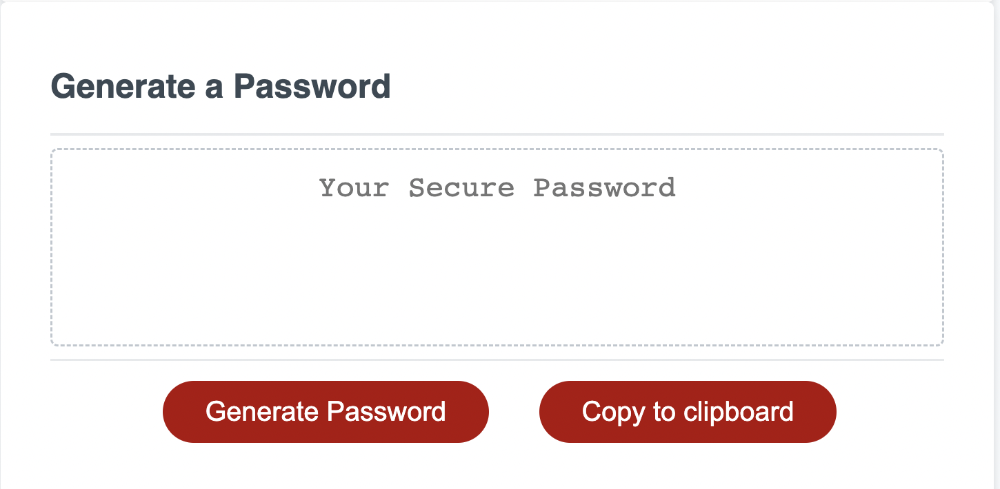

# PasswordGenerator
Password Generator


## Author: 
Mark Edwards

## Deployment:
[Live](https://mark-227-g.github.io/passwordgenerator/)
### User Story:
```
AS AN employee with access to sensitive data
I WANT to randomly generate a password that meets certain criteria
SO THAT I can create a strong password that provides greater security
```
#### Acceptance Criteria
```
GIVEN I need a new, secure password
WHEN I click the button to generate a password
THEN I am presented with a series of prompts for password criteria
WHEN prompted for password criteria
THEN I select which criteria to include in the password
WHEN prompted for the length of the password
THEN I choose a length of at least 8 characters and no more than 128 characters
WHEN asked for character types to include in the password
THEN I confirm whether or not to include lowercase, uppercase, numeric, and/or special characters
WHEN I answer each prompt
THEN my input should be validated and at least one character type should be selected
WHEN all prompts are answered
THEN a password is generated that matches the selected criteria
WHEN the password is generated
THEN the password is either displayed in an alert or written to the page
```

#### Screenshots
##### Step 1 - Initial start screen: Press start to begin

##### Step 2 - Enter password length. Press next button.

##### Step 2e - Error message is displayed if length is wrong

##### Step 3 - Select data type to include in password. Press next button

##### Step 3e - Error message is displayed if nothing is selected.

##### Step 4 - After passing validation press Generate Password button to create a password. 

##### The password will be generated and displayed

##### Option - Press Copy to clipboard button to save password. 
##### Use the Reset button to start again. 
<br>
### Technology used:
HTML5 semantic tags, CSS3, and javascript. Deployed using github pages.

### References:

* [W3schools](https://www.w3schools.com/html/html5_semantic_elements.asp)
* [devicedocs](https://devdocs.io/css/)
* [javapoint](https://www.javatpoint.com/css-tutorial)


